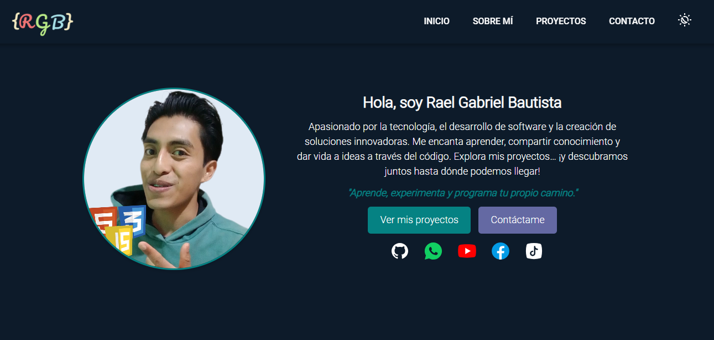

# 🌐 Portafolio Web - Rael Gabriel Bautista

Bienvenido a mi portafolio web personal, donde muestro algunos de mis proyectos, habilidades y formas de contacto. Este sitio fue creado para reflejar mi evolución como desarrollador y compartir mis trabajos de manera visual, responsiva y profesional.

## 🚀 Tecnologías Utilizadas

- HTML5
- CSS3 (con variables personalizadas y media queries)
- JavaScript
- Git y GitHub
- FormSubmit (para el formulario de contacto)
- GitHub Pages (para la publicación del sitio)

## 🌍 Publicación

Este portafolio está publicado con **GitHub Pages** y accesible en la siguiente URL:

🔗 [https://RGBCode0.github.io/](https://RGBCode0.github.io/)

## 📱 Responsivo

El diseño se adaptó para que funcione en:
- Teléfonos móviles 📱
- Pantallas de escritorio 💻
## 📸 Captura del Sitio

## 👨‍💻 Sobre mí

Soy Rael Gabriel Bautista, desarrollador en formación apasionado por la tecnología, la programación y el diseño de interfaces. Este portafolio es parte de mi camino de aprendizaje y práctica constante.

- 🌐 [YouTube: RGBCodeOficial](https://www.youtube.com/@RGBCodeOficial)
- 🐱 [GitHub: RGBCode0](https://github.com/RGBCode0)
- 📘 [Facebook: RgbCoder](https://www.facebook.com/RgbCoder)
- 🎵 [TikTok: @rgbcoder](https://www.tiktok.com/@rgbcoder)